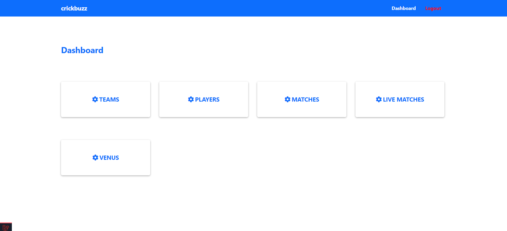
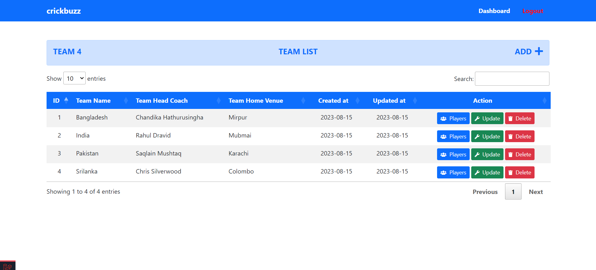
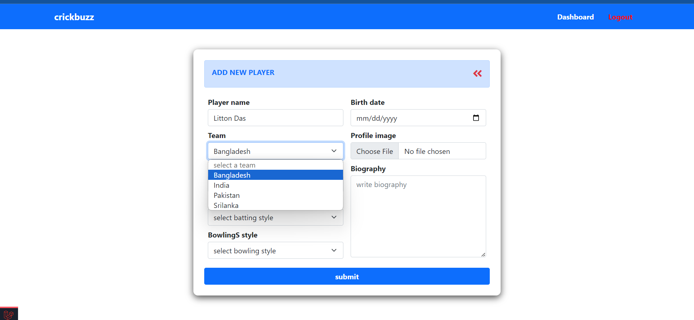
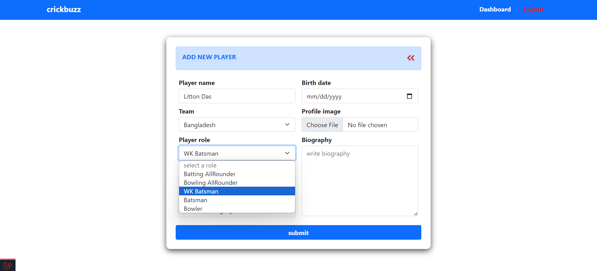
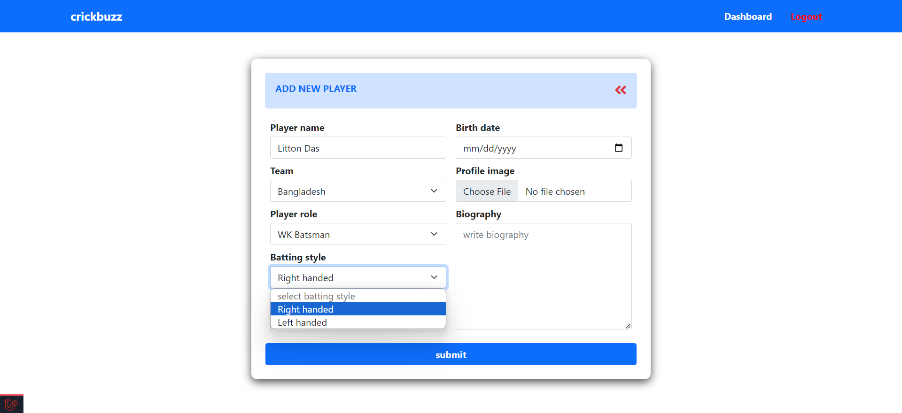
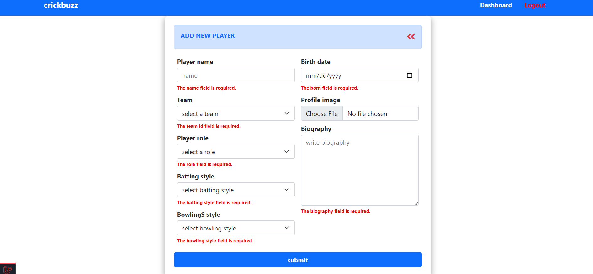
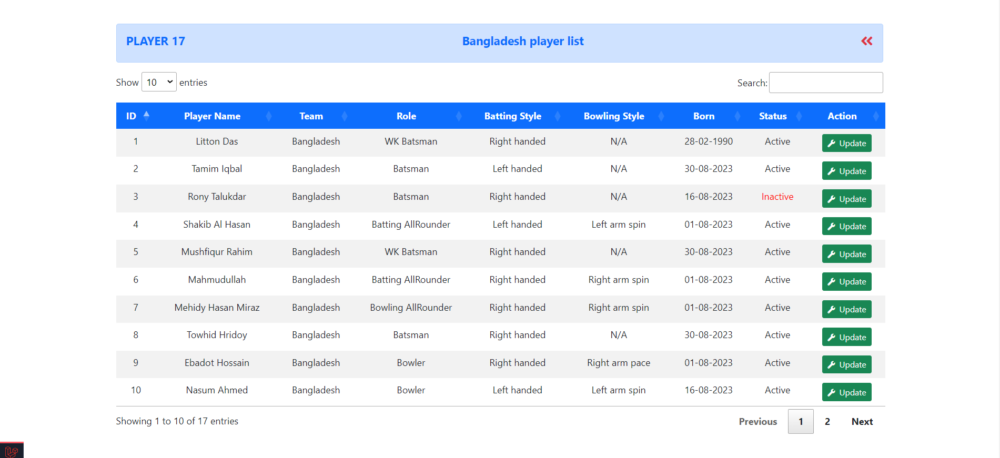

# Cricket Match Management Web Application
## Overview

This web application is built using the Laravel framework, offering a comprehensive solution for managing cricket matches, teams, players, and live match scores. It empowers administrators to effortlessly create and oversee cricket-related data, all from a centralized dashboard. Meanwhile, cricket enthusiasts and fans can stay up-to-date with live match scores through a user-friendly public page.

## Installation

Follow these simple steps to get the Cricket Match Management Web Application up and running on your local environment:

1. **Clone the Repository**: Use `git clone` to clone this repository to your local machine.
2. **Install Dependencies**: Run `composer install` to install the necessary PHP dependencies and `npm install` to install the JavaScript dependencies.
3. **Database Configuration**: Set up your database configuration in the `.env` file and run the necessary migrations and seeders.
4. **Start the Application**: Run `php artisan serve` to start the development server.
5. **Access the Application**: Open your web browser and go to `http://localhost:8000` to access the application.

## Features

- **Admin Dashboard**: Administrators can create and manage venues, teams, and players with ease, ensuring all cricket-related information is up-to-date and accurate.

- **Live Match Score Control**: The admin dashboard provides the capability to input and control live match scores in real-time, enhancing the engagement and excitement of cricket matches.

- **Public Live Scores**: Cricket fans and users can access a dedicated public page to view live match scores, ensuring they never miss a moment of the action.

## Screenshots

### Public Live Scores Page

### Admin Dashboard
    
    

